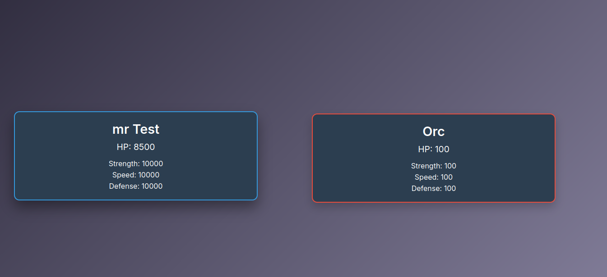

<h1>🚀 Projet combat en PHP</h1>

<h2>🚀 Démo</h2>
    
Le jeu est déployé et accessible en ligne : <a href="https://nadir-puissance4.pro4.garage404.com/" target="_blank">Jouer à Puissance 4</a>

<h2>🛠 Technologies utilisées</h2>
<ul>
    <li><strong>PHP</strong> : Langage principal pour le backend</li>
    <li><strong>MySQL</strong> : Base de données relationnelle</li>
    <li><strong>JavaScript</strong> : Interactions côté client</li>
    <li><strong>CSS</strong> : Mise en page et styles</li>
</ul>

<h2>🎯 Patterns de conception utilisés</h2>
<ul>
    <li><strong>DAO (Data Access Object)</strong> : Séparation des requêtes SQL de la logique métier</li>
    <li><strong>Singleton</strong> : Gestion optimisée de la connexion à la base de données</li>
    <li><strong>Factory</strong> : Création dynamique d'objets</li>
</ul>

<h2>⚙️ Fonctionnalités</h2>
<ul>
    <li>Connexion et gestion sécurisée des utilisateurs</li>
    <li>CRUD (Create, Read, Update, Delete) sur plusieurs entités</li>
    <li>Utilisation de requêtes préparées pour éviter les injections SQL</li>
    <li>Architecture modulaire facilitant l'extensibilité</li>
    <li>Utilisation des patterns design, Interface, Traits</li>
</ul>

<h2>📷 Aperçu</h2>
</img>
